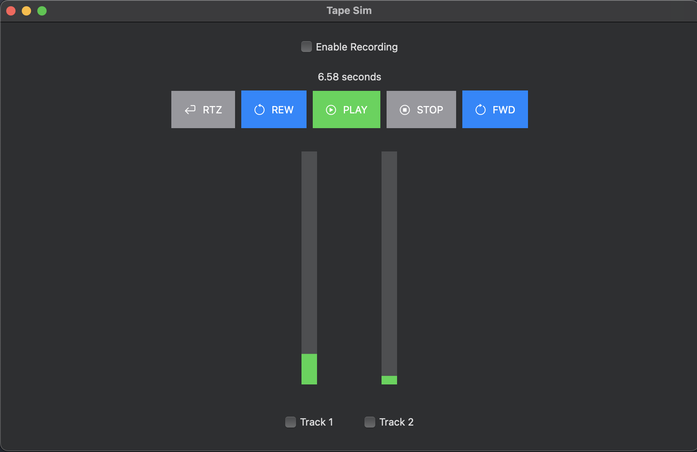
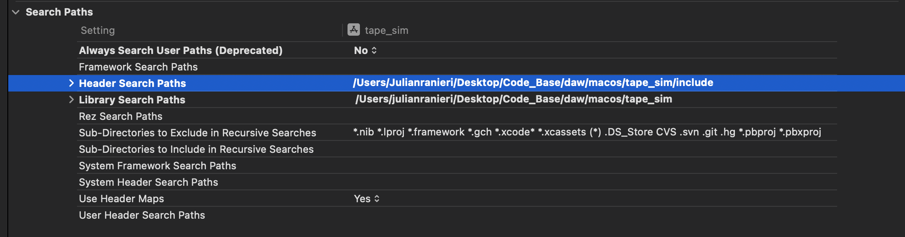

# TapeSim DAW
Tape Sim intends to simulate a simple tape machine experience by recording and playing audio with a simple UI.

The program can record as many tracks as there are inputs in your default audio device and allows you to rewind, fast-forward and re-record over a section of time.

By selecting the checkbox next to the track name you record enable that track so that during recording those tracks will write, however they will not playback while in record-enable mode.

Playback is mapped 1-1 input to output. So if there are 4 inputs, 4 wav files are created and playedback on outputs 1-4. If there are not as many outputs as inputs then the program will crash.

Recordings and playback are in mono at 48khz 24bit quality.

Current UI available for this program is for MacOS(Intel x86_64) made with SwiftUI.



## Resources

wav spec https://docs.fileformat.com/audio/wav/

port audio https://portaudio.com/docs/v19-doxydocs/index.html

## SETUP

### C Program logic layer
If you want to work on the logic layer alone you can compile the program with gcc and use the right flags to link the dependencies including port audio. Make sure to download and compile port audio on your machine. You may need to compile targeting a certain mac version to be consistent with the SwiftUI app.

Here is what I used to compile PA using cmake and setting target osx 11. 

```
cd portaudio        
mkdir build && cd build
cmake -DCMAKE_OSX_DEPLOYMENT_TARGET=11  .. -DBUILD_SHARED_LIBS=OFF
make
```

Then to compile the c program here is an example. Make sure to reference the correct directory that your PA build is in.
```
gcc -o audio audio.c -I../portaudio/include -L../portaudio/build -lportaudio -framework CoreAudio -framework AudioToolbox -framework AudioUnit -framework CoreServices
```
### SwiftUI on Xcode
Xcode version - Version 15.2

You need to make sure that you are also linking all the correct binaries in xcode. In Build Phases, it should look like this:


Also, for search paths, you should have something like this for header and library:


